# Harnessing Machine Learning to Predict and Analyze Diabetes Risk


## Introduction:

Diabetes mellitus is a global health concern, impacting millions of lives annually. Early detection and proactive management are critical to reducing its impact. This project utilized machine learning (ML) to predict diabetes risk based on patient data, offering insights into key risk factors and the potential for data-driven healthcare interventions.
To understand more about diabetes, I outlined very concisely all you need to know in these posts.

Post 1: [I discussed diabetes, touching on its prevalence, symptoms, causes, types, and risk factors here](https://www.linkedin.com/posts/onyemacemmanuel_diabetes-bloodsugar-sugar-activity-7263635107389833216-O1PT?utm_source=share&utm_medium=member_desktop).

Post 2: [I discussed testing, prevention, and management here](https://www.linkedin.com/posts/onyemacemmanuel_diabetes-bloodsugar-sugar-activity-7264980105133740032-xF9s?utm_source=share&utm_medium=member_desktop).

---

## Objectives:

- Develop a machine learning model to predict diabetes risk with high accuracy 80% +.
- Analyze data to identify significant predictors of diabetes.

---

## Workflow:

1. Data Loading
2. Data Cleaning
3. EDA and Feature Engineering
4. Feature Selection
5. Data Preprocessing
6. Splitting Data
7. Model Selection and Training
8. Model Evaluation
9. Conclusion and Reporting

---

## Understanding the Dataset:

### Dataset Overview

We used the Pima Indians Diabetes Dataset with 768 rows, and 9 columns, It also contains some clinical features related to diabetes.

> Features:

- Glucose Level
- Blood Pressure
- Insulin Levels
- BMI (Body Mass Index)
- Age
- Skin Thickness
- Number of Pregnancies
- Diabetes Pedigree Function (Genetic Risk Factor)

> Target Variable:

- Outcome (binary: 0 = No, 1 = Yes).

---

## Data Cleaning:

At Initial glance, it seems like there were no missing values. But a second look with an industry eye at the descriptive summary uncovered the inappropriateness of the data, As its odd to have zero(0) as the min for the features values.


### Handling Missing Values:

Replaced zero values in features like insulin and BMI with NaN value to reveal missing values.

|      Replacing zero values       |         Visualization         |
| :------------------------------: | :---------------------------: |
|  | 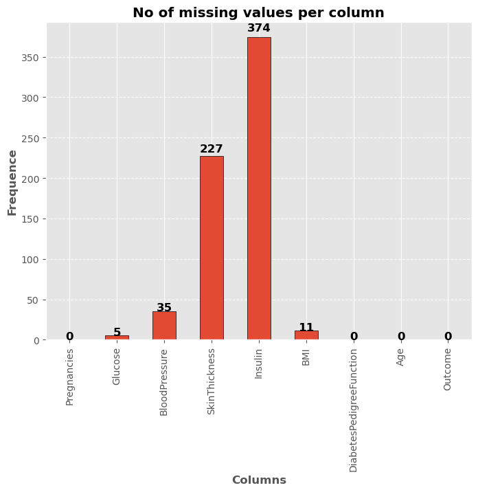 |

#### FIx by replacing zero values with the median

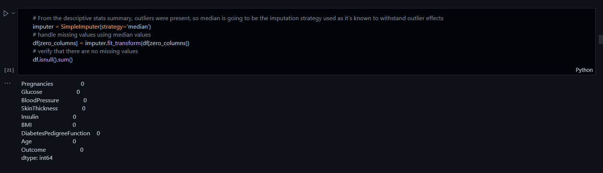

---

## Exploratory Data Analysis (EDA):

EDA provided critical insights into the dataset:
Key Findings after the features were cut into bins

- **Insulin Levels**: Strongly correlated with diabetes. Individuals with glucose levels above 140 mg/dL showed a higher probability of diabetes.
  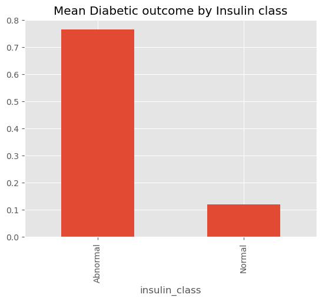
- **Glucose Levels**: Strongly correlated with diabetes. Individuals with glucose levels above 140 mg/dL showed a higher probability of diabetes.
  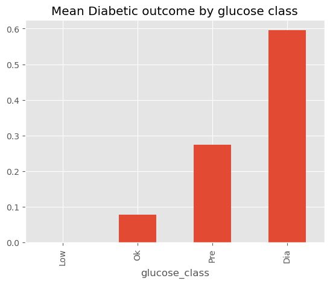
- **BMI**: Higher BMI values significantly increased diabetes risk, emphasizing the role of weight management.
  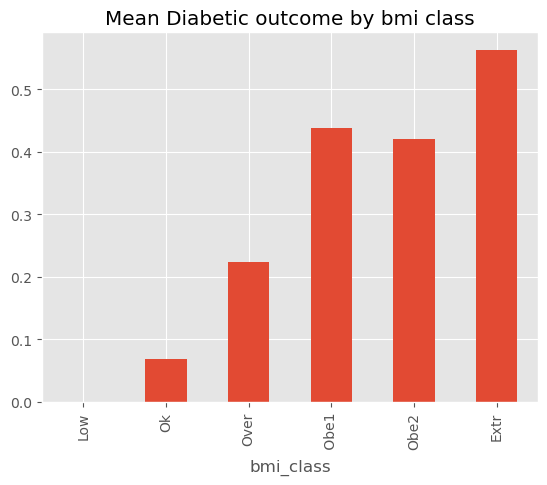
- **Age**: Older individuals, had a higher prevalence of diabetes.
  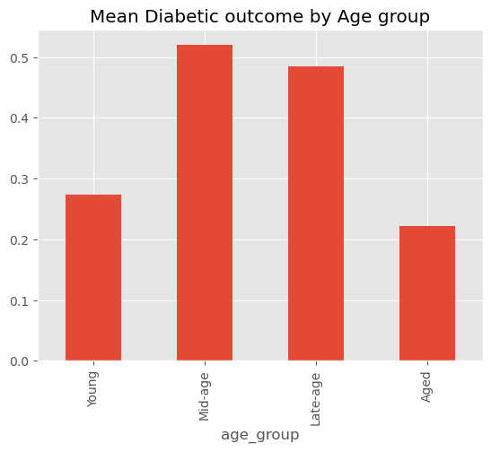

### Feature Interactions:

Combined Glucose, BMI, BloodPressure, Insulin and Pregnancy levels to create a risk score to revealed individuals with heightened risk.

```
 df['risk'] = ((df['Glucose'] >110).astype(int)+(df['BMI']>30).astype(int)+(df['BloodPressure']>130).astype(int)+(df['Insulin']>100).astype(int)+(df['Pregnancies']>5).astype(int))
```

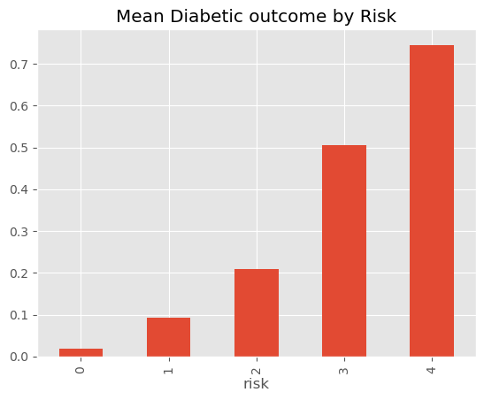

#### Visualization Techniques

**Correlation Heatmap**: Highlighted relationships between features.
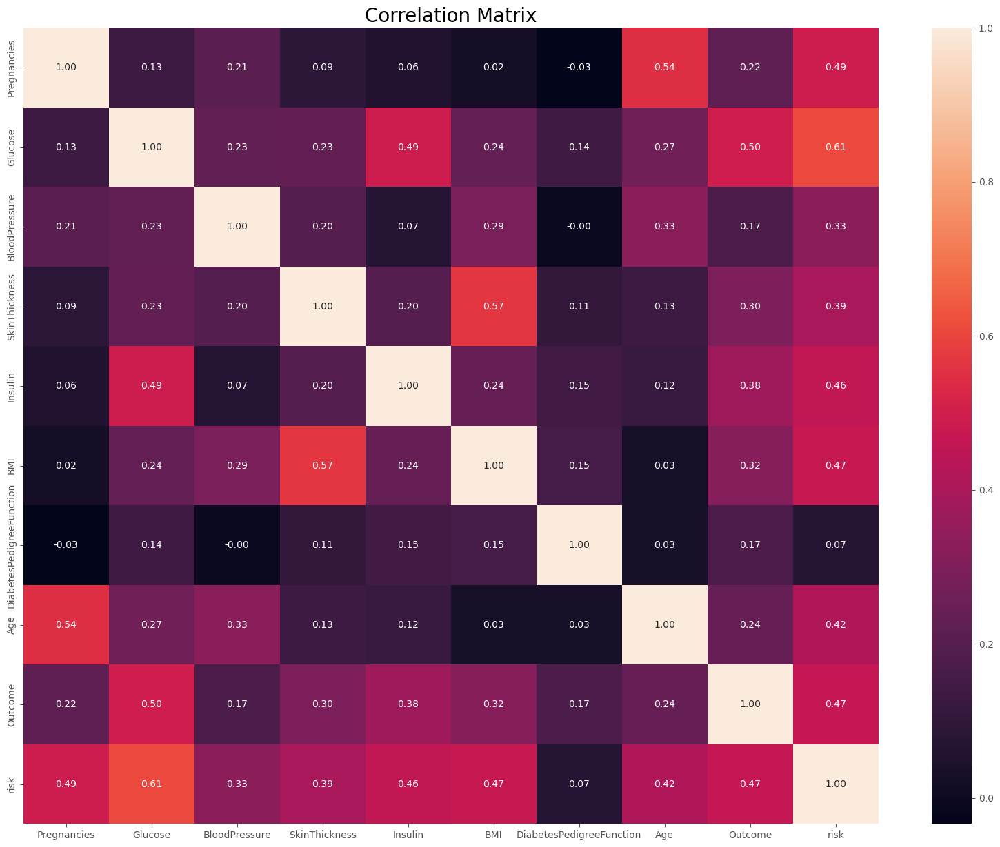
**Pair Plots**: Revealed feature interactions and data distributions.
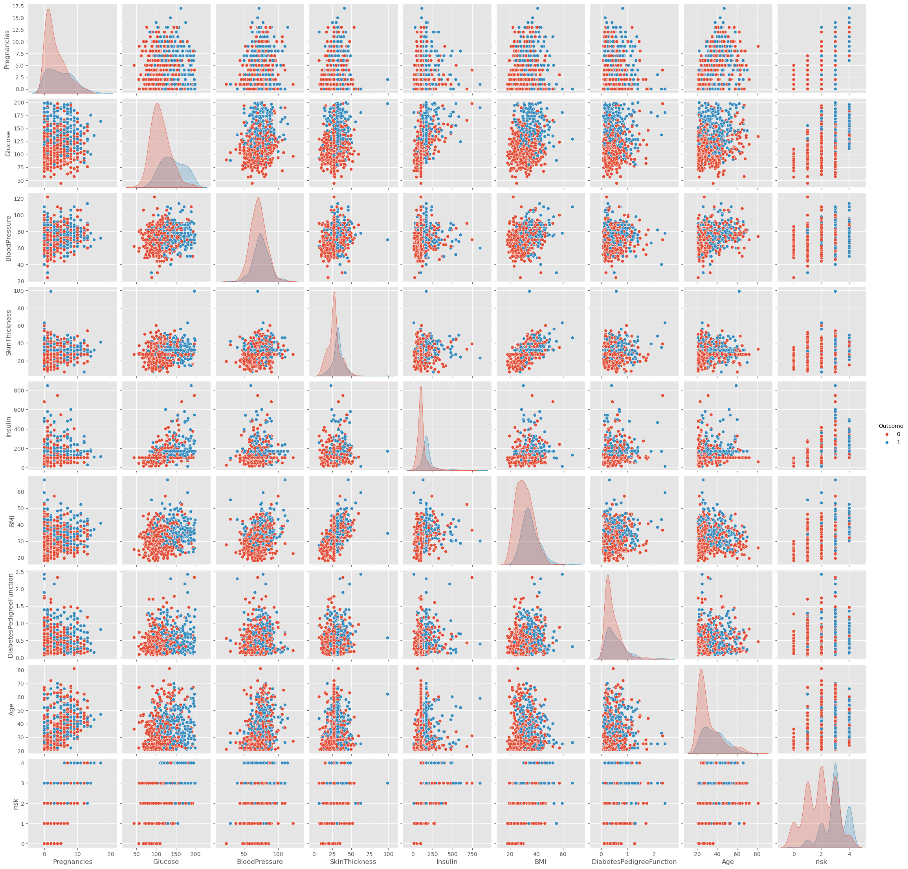
**Scatter Plots**: Revealed feature interactions and data distributions.
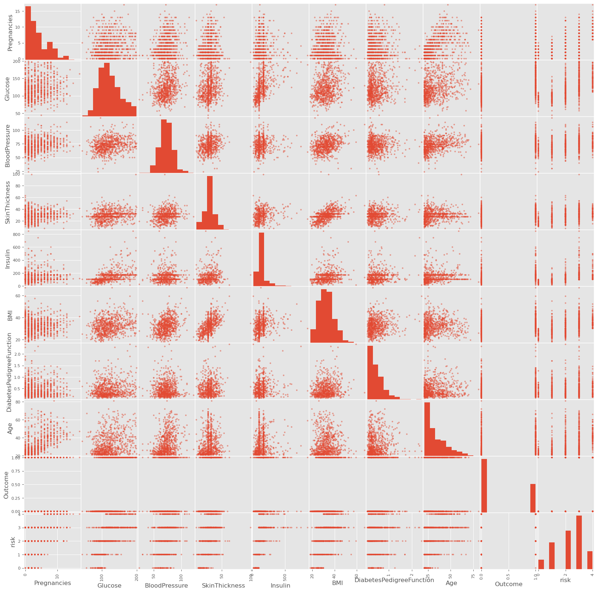
**Box Plots**: Identified outliers in critical features like glucose and insulin levels.
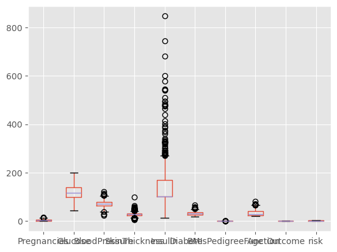


---

## Model Development:

We implemented various ML algorithms to predict diabetes and selected the best-performing model.
Algorithms Used

- Logistic Regression
- Random Forest
- Support Vector Machine
- Decision Tree
- K-Nearest Neighbour
- Naive Bayes
- Gradient boosting

---

## Model Evaluation Metrics:

- F1-Score
- Recall
- Accuracy
- Precision


The Gradient Boosting Classifier model achieved the highest metrics making it the best choice for this dataset.

---

## Interpretability and Insights

Glucose levels had the highest impact on predictions, followed by BMI and age.
Genetic predisposition (diabetes pedigree function) played a significant role in certain cases.
Feature interactions revealed nuanced risk profiles, aiding personalized interventions.

---

## Implications and Applications

Healthcare Screening: The model can assist healthcare professionals in identifying at-risk individuals for early intervention.
Public Health Insights: Data-driven insights can guide awareness campaigns, focusing on lifestyle modifications and regular check-ups.
Policy Recommendations: Emphasizing preventive measures in populations with higher genetic or lifestyle risks.

---

## Challenges and Limitations

Data Imbalance: The dataset had more non-diabetic cases, requiring balancing techniques like SMOTE (Synthetic Minority Over-sampling Technique).
Limited Features: The dataset lacked information on dietary habits, physical activity, and other socio-economic factors.
Generalizability: Results are specific to the dataset used and require validation on larger, diverse populations.

---

## Future Directions

Expanding Features: Incorporate additional factors such as lifestyle habits, genetic markers, and real-time glucose monitoring data.
Integration with Wearables: Link machine learning models with wearable devices for continuous monitoring and prediction.
Deployment: Develop a user-friendly app or API for clinicians and individuals to leverage the model's predictions.

---

## Conclusion

This project demonstrated the potential of machine learning in addressing diabetes, a critical global health issue. By combining advanced algorithms with detailed data analysis, we can pave the way for smarter, more effective healthcare solutions.
What's Next? Let's collaborate to take this further - integrating real-world applications and advancing healthcare innovation.
